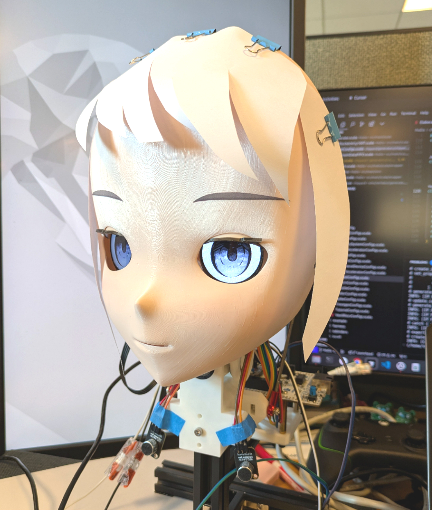

# An animatronic head

Note: The original code and report is stored on [ee249 branch](https://github.com/T-K-233/NAI-Head/tree/ee249).




This project presents the development of an anime-inspired robotic head designed for cyber-physical systems research, integrating advanced computational techniques, aesthetic considerations, and mechanical engineering. The system features a multi-platform architecture that combines STM32 microcontrollers, FPGA-based gesture recognition, and neural networks deployed on edge AI devices. By coordinating eye and head movements and dynamically responding to user interactions, the robot achieves lifelike and engaging interactions. The implementation of gesture recognition through machine learning, along with finite state machine-based behavior control, enhances the robot's capability for natural human-robot interactions. The mechanical structure, created using OnShape and Blender, supports versatile movement and expressive gestures. 


## Directory Structure

`Baremetal-IDE/` and `Baremetal-NN/` contain the code for setting up a baremetal environment from scratch on RISC-V platforms and runs the neural network inference. It also includes a Python script for C code generation from a PyTorch model.

`firmware/` contains the firmware for the STM32 microcontroller. We use STM32F446 for functional prototyping of each module, and integrate the final project on STM32F429. The `convert.py` script is used to generate the binary RGB565 image from the original PNG file for the LCD display.

`host/` contains bridge code for interacting with the VTubeStudio software.

`MaDa/` contains the code for generating the FPGA bitstream to perform edge inference on RISC-V design on FPGA.

`mechanical/` contains the intermediate files for building the mechanical structure of the robot. The rest of the files are available in the [Onshape project](https://cad.onshape.com/documents/7b6f8264bfc266305901c995/w/1ddfe8bb1118d3d58069c09d/e/082a5b68c1e32d8598ae1104?renderMode=0&uiState=6764993fe5979f2d0a5df6a9).

`neural/` contains the gesture recognition model and the code for training and inference on host PC.


## Hardware Setup

### Wiring

| Index | Board Pin | STM32 Pin (L) | STM32 Pin (R) | Description                                      |
| ----- | --------- | ------------- | ------------- | ------------------------------------------------ |
|     1 | GND       | GND           | GND           | Ground                                           |
|     2 | VIN       | 3V3           | 3V3           | Power, 3.3V ~ 5V                                 |
|     3 | SCL       | PA5 (SCLK)    | PB13 (SCLK)   | SPI clock input                                  |
|     4 | SDA       | PA7 (MOSI)    | PB15 (MOSI)   | SPI data input                                   |
|     5 | RES       | PA9           | PB2           | Reset, active low                                |
|     6 | DC        | PA8           | PB1           | Data / Command select, low: command; high: data  |
|     7 | CS        | PB6           | PA11          | SPI chip select, active low                      |
|     8 | BLK       | PC7           | PB12          | Backlight enable, default pull-up to 3V3         |

### Peripheral Allocation

#### SPI

- Frame Format: Motorola
- Data Size: 8 bits
- First Bit: MSB First
- Baud Rate: 20 Mbps
- Clock Polarity: Low
- Clock Phase: 1st Edge
- NSS Signal: Software Controlled

#### Timer

- Prescaler: 79
- Counter Mode: Up
- Counter Period: 19999
- PWM Generation
  - PWM Mode: Mode 1
  - Pulse: 1500
  - Output Compare Preload: Enable
  - Fast Mode: Disable
  - CH Polarity: High
 
### Clock Tree Settings

SPI1 and TIM1, TIM8 are under the high speed APB2 bus; SPI2 and TIM2-7 are under APB1 bus. This information can be verified in Table 1 of [RM0090
Reference manual](https://www.st.com/resource/en/reference_manual/dm00031020-stm32f405-415-stm32f407-417-stm32f427-437-and-stm32f429-439-advanced-arm-based-32-bit-mcus-stmicroelectronics.pdf).

APB1 bus is configured to have 40 MHz clock (PCLK1 = 40 MHz, 45 MHz max); APB2 bus is configured to have 80 MHz clock (PCLK2 = 80MHz, 90 MHz max).

We need to configure the prescaler of each peripheral accordingly.


### Communication Frame

#### UDP Frame

| Idx | Name                | Byte Range | Type    |
| --- | ------------------- | ---------- | ------- |
| 0   | Head X              | 0:4        | float32 |
| 1   | Head Y              | 4:8        | float32 |
| 2   | Head Z              | 8:12       | float32 |
| 3   | Eye Left X          | 12:16      | float32 |
| 4   | Eye Left Y          | 16:20      | float32 |
| 5   | Eye Right X         | 20:24      | float32 |
| 6   | Eye Right Y         | 24:28      | float32 |
| 7   | Eye Left Openness   | 28:32      | float32 |
| 8   | Eye Right Openness  | 32:36      | float32 |


## Solving Protobuf issue in Windows


```powershell
$env:PROTOCOL_BUFFERS_PYTHON_IMPLEMENTATION = "python"
```
